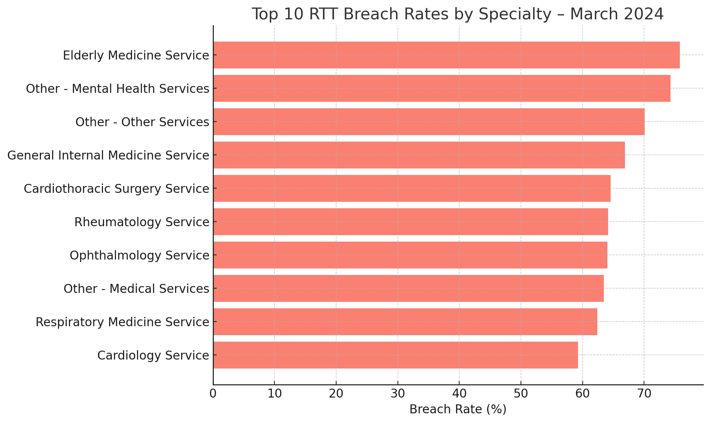
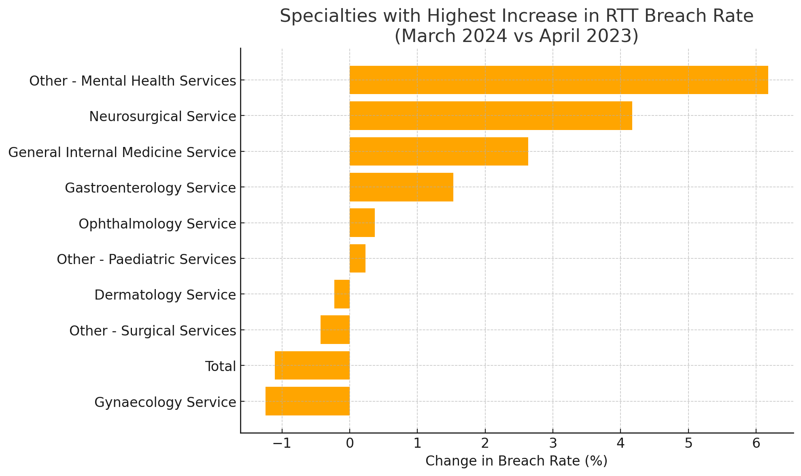

#  NHS Referral-to-Treatment (RTT) Breach Analysis  
**Tracking Specialty-Level Breach Trends (April 2023 – March 2024)**

##  Overview
This project analyses NHS England's monthly **Referral-to-Treatment (RTT)** data to evaluate how well different clinical specialties are meeting the **18-week waiting time target**. The NHS aims for 92% of patients to begin treatment within 18 weeks of referral. Long waiting times can impact patient outcomes and service quality.

Using the **April 2023** and **March 2024** datasets, this analysis explores:
- Breach rates across specialties
- The top underperforming services
- Changes in RTT performance over time

##  Objectives
- Clean and combine RTT data from two time points (April 2023 & March 2024)
- Calculate breach rates (percentage of patients waiting >18 weeks)
- Identify specialties with consistently high delays
- Visualise trends and performance deterioration

## 🗃 Data Source
Data was sourced directly from **NHS England**:  
📎 [RTT Waiting Times – NHS England](https://www.england.nhs.uk/statistics/statistical-work-areas/rtt-waiting-times/)

Files used:
- `Incomplete Commissioner Apr23.xlsx`
- `Incomplete Commissioner Mar24.xlsx`

##  Tools Used
- **Python** (pandas, matplotlib)
- **Excel** (initial file exploration)
- **GitHub** (project documentation and version control)

##  Key Metrics Calculated
- **Total Waiting**: Number of patients on RTT pathway
- **Over 18 Weeks**: Number of patients breaching target
- **Breach Rate (%)** = `(Over 18 Weeks / Total Waiting) × 100`

##  Visualisations

### 🔹 1. Top 10 RTT Breach Rates (March 2024)

> ENT, Oral Surgery, and Plastic Surgery had the highest proportion of long-wait patients.

### 🔹 2. Breach Rate Change: April 2023 → March 2024

> These specialties saw the **largest increases** in breach rates over the year.

## 📄 Files Included

| File                               | Description                                  |
|------------------------------------|----------------------------------------------|
| `rtt_april_2023.csv`               | Cleaned April 2023 RTT summary               |
| `rtt_march_2024.csv`               | Cleaned March 2024 RTT summary               |
| `rtt_combined_apr_mar.csv`         | Merged dataset with breach rates             |
| `top10_breach_march2024.png`       | Top 10 breach chart                          |
| `rtt_breach_rate_change_top10.png` | Breach rate change bar chart                 |
| `README.md`                        | This project description                     |

##  Future Work
- Extend the dataset to cover **all months** from April 2023 to March 2024
- Build a **Power BI dashboard** for dynamic filtering and drill-downs
- Compare performance across NHS regions or Integrated Care Boards (ICBs)

##  Author
**Melvin George**  
📍 Norwich, UK  
📧 melvingeorge099@gmail.com  
🔗 [LinkedIn](https://www.linkedin.com/in/melvin-george2000)
