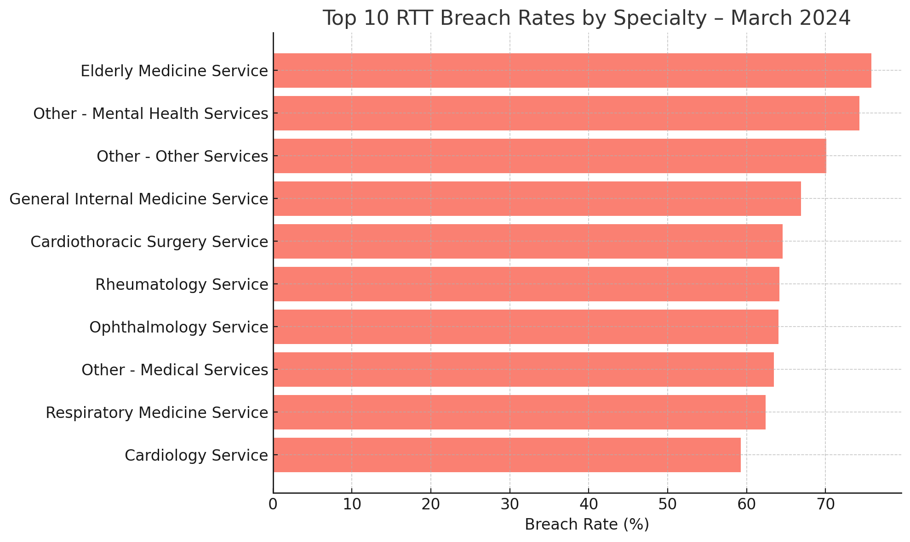
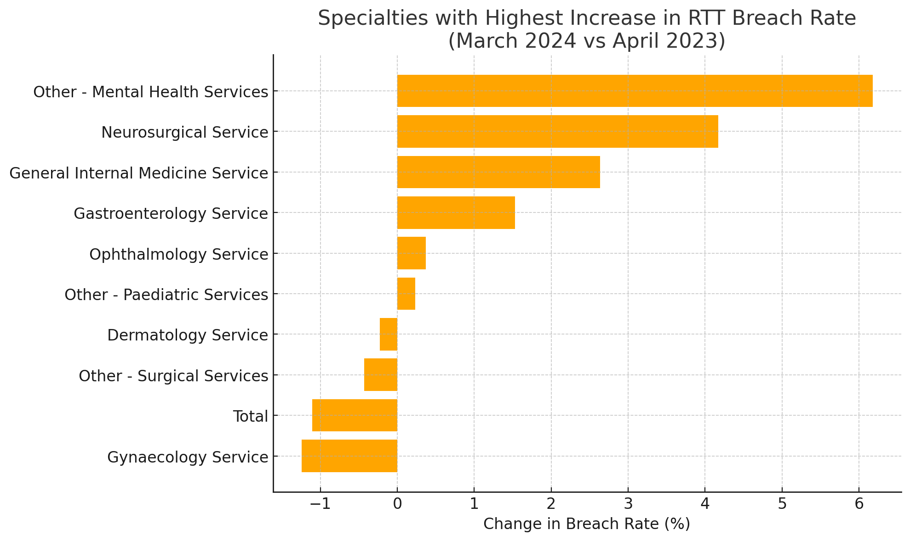
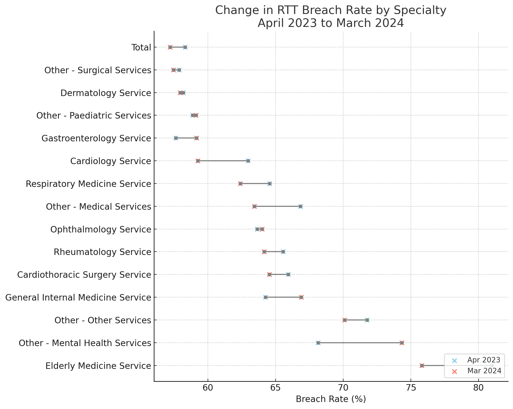

# NHS RTT Breach Analysis  
**Analysing Specialty-Level Trends in Referral-to-Treatment Performance (April 2023 – March 2024)**

This project explores waiting time performance across clinical specialties in the NHS, using publicly available Referral-to-Treatment (RTT) data. The NHS targets that 92% of patients should begin treatment within 18 weeks of referral. The analysis focuses on breach rates — the proportion of patients waiting beyond that limit — and how they changed over a 12-month period.

## Objectives
- Process and clean RTT commissioner data for April 2023 and March 2024
- Calculate breach rates for each specialty
- Compare performance between the two months
- Identify specialties showing the highest breach levels and worsening trends
- Communicate findings visually

## Data Source
Data was sourced from the NHS England RTT waiting times statistics portal:  
[https://www.england.nhs.uk/statistics/statistical-work-areas/rtt-waiting-times/](https://www.england.nhs.uk/statistics/statistical-work-areas/rtt-waiting-times/)

Used files:
- Incomplete Commissioner Apr23.xlsx
- Incomplete Commissioner Mar24.xlsx

## Tools Used
- Python (pandas, matplotlib)
- Excel (for initial review)
- Jupyter Notebook
- GitHub (for version control and sharing)

## Key Metrics
- **Total Waiting** – Number of patients still waiting for treatment
- **Over 18 Weeks** – Patients breaching the 18-week target
- **Breach Rate (%)** – Calculated as `(Over 18 Weeks / Total Waiting) × 100`

---

## Visualisations

### 1. Top 10 Specialties by Breach Rate (March 2024)

**Elderly Medicine**, **Mental Health Services**, and **General Internal Medicine** had the highest percentage of long-wait patients in March 2024, exceeding 65% breach rates.

---

### 2. Breach Rate Change – April 2023 to March 2024

This chart shows which specialties saw the **biggest increase in breach rate** over the year. Mental Health Services, Neurosurgery, and General Medicine all recorded notable deterioration.

---

### 3. Change in Breach Rate by Specialty (Dumbbell Plot)

This plot compares breach rates side-by-side for each specialty in April 2023 vs March 2024. Longer lines indicate bigger changes, whether positive or negative.

---

## Observations

- Breach rates were **consistently high** in some specialties like Elderly Medicine and Mental Health.
- Three specialties — **Mental Health**, **General Internal Medicine**, and **Ophthalmology** — appeared in both the top breach and top breach increase charts, indicating they are not only struggling but worsening.
- Some specialties, such as Dermatology and Gynaecology, actually showed slight improvement over the period.

---

## Files Included

| File                               | Description                                  |
|------------------------------------|----------------------------------------------|
| `rtt_april_2023.csv`               | Cleaned April 2023 RTT data                  |
| `rtt_march_2024.csv`               | Cleaned March 2024 RTT data                  |
| `rtt_combined_apr_mar.csv`         | Combined dataset                             |
| `top10_breach_march2024.png`       | Top 10 breach rate chart                     |
| `rtt_breach_rate_change_top10.png` | Chart showing breach rate change             |
| `rtt_dumbbell_breach_change.png`   | Before-after plot of breach rate per specialty |
| `rtt_analysis.ipynb`               | Notebook with full workflow                  |
| `rtt_cleaning.py`                  | Python script for data cleaning              |

---

## Future Work

- Extend this to a full-year trend (April 2023–March 2024)
- Build a Power BI dashboard for dynamic filtering and visual interaction
- Explore regional-level performance using ICB or Trust-level data

---

## About

**Melvin George**  
📍 Norwich, UK  
📧 melvingeorge099@gmail.com  
🔗 [LinkedIn](https://www.linkedin.com/in/melvin-george2000)

